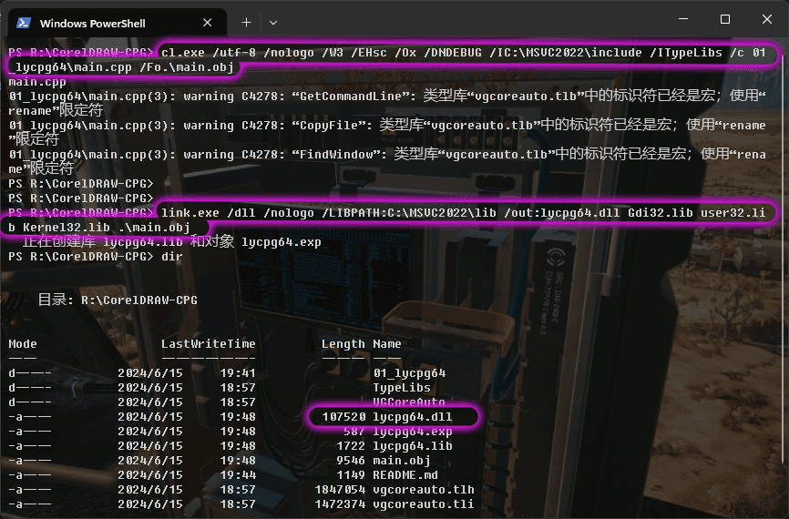

# CorelDRAW-CPG
CorelDRAW CPG 扩展开发: CPG(Corel Plug-in Gallery)是 CorelDRAW 的一个扩展机制,可以开发自定义的插件和工具。


## CorelDRAW Graphics Suite 2020  Programs64 TypeLibs

- 学习编写CPG插件，一般只用到  [`VGCoreAuto.tlb`](./TypeLibs/VGCoreAuto.tlb) 这个文件就够
- 类型库 `vgcoreauto.tlb` 的包装器实现: [`vgcoreauto.tlh`  `vgcoreauto.tli`](./VGCoreAuto/) 这两个文件可以查看类型库的接口定义


## CorelDRAW CPG 扩展开发环境之最简陋环境搭建
- https://wwm.lanzout.com/b0r9anaqb 密码:1diw

- 下载 `MSVC2022_X64_mini.7z` 压缩包解压到任意目录下, 推荐 `C:\MSVC2022`

- 配置 `MSVC2022` 运行环境，参考如下

```
INCLUDE=C:\MSVC2022\include
LIB=C:\MSVC2022\lib
Path=C:\MSVC2022\bin;%PATH%
```

## 构建: `Release` 在 `lycpg64` 中 (编译器: Microsoft Visual C++ 2022)

```
cl.exe /nologo /W3 /EHsc /Ox /DNDEBUG /IC:\MSVC2022\include /ITypeLibs  /c 01_lycpg64\main.cpp /Fo.\main.obj

link.exe /dll /nologo /LIBPATH:C:\MSVC2022\lib /out:lycpg64.dll Gdi32.lib user32.lib Kernel32.lib .\main.obj
```

### 构建 `lycpg64.dll` CPG插件, 编译示例图，改名成 `lycpg64.cpg` ，然后复制到 `CorelDRAW\Draw\Plugins64` 目录

 