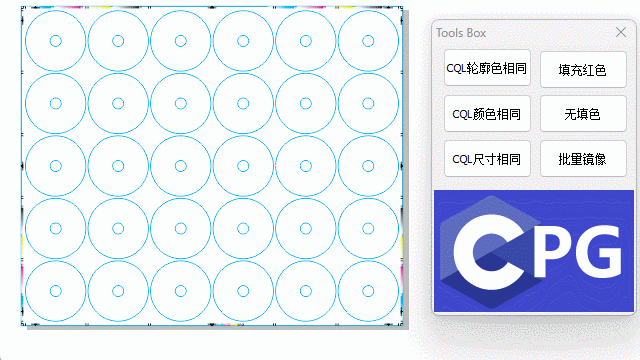

# CorelDRAW-CPG
CorelDRAW CPG 扩展开发: CPG(Corel Plug-in Gallery)是 CorelDRAW 的一个扩展机制,可以开发自定义的插件和工具。


## CorelDRAW Graphics Suite 2020  Programs64 TypeLibs

- 学习编写CPG插件，一般只用到  [`VGCoreAuto.tlb`](./TypeLibs/VGCoreAuto.tlb) 这个文件就够
- 类型库 `vgcoreauto.tlb` 的包装器实现: [`vgcoreauto.tlh`  `vgcoreauto.tli`](./VGCoreAuto/) 这两个文件可以查看类型库的接口定义


## CorelDRAW CPG 扩展开发环境之最简陋环境搭建
- https://wwm.lanzout.com/b0r9anaqb 密码:1diw

- 下载 `MSVC2022_X64_mini.7z` 压缩包解压到任意目录下, 推荐 `C:\MSVC2022`

- 配置 `MSVC2022` 运行环境，参考如下

```
INCLUDE=C:\MSVC2022\include
LIB=C:\MSVC2022\lib
Path=C:\MSVC2022\bin;%PATH%
```

## 构建: `Release` 在 `lycpg64` 中 (编译器: Microsoft Visual C++ 2022)

```shell
cl.exe /nologo /W3 /EHsc /Ox /DNDEBUG /IC:\MSVC2022\include /ITypeLibs  /c 01_lycpg64\main.cpp /Fo.\main.obj

link.exe /dll /nologo /LIBPATH:C:\MSVC2022\lib /out:lycpg64.dll Gdi32.lib user32.lib Kernel32.lib .\main.obj
```

### 构建 `lycpg64.dll` CPG插件, 编译示例图，改名成 `lycpg64.cpg` ，然后复制到 `CorelDRAW\Draw\Plugins64` 目录

 


## 感谢 fersatgit  学习项目 `03_ClearFill` 修复CorelDRAW 2020 使用错误
- 答疑解惑网址: https://github.com/fersatgit/SmartDepart/issues/1 
 

```cpp
STDMETHODIMP CVGAppPlugin::raw_StartSession()
{
  try
  {
    m_pApp->AddPluginCommand(_bstr_t("ClearFill"), _bstr_t("Clear Fill"), _bstr_t("Clears fill from selected objects"));

    // CorelDRAW X6 使用 VGCore::CommandBarControlPtr ctl
    // CorelDRAW 2020 SDK 使用  VGCore::ICUIControlPtr ctl

    // https://github.com/fersatgit/SmartDepart/issues/1    // 感谢 fersatgit 修复CorelDRAW 2020 使用错误
    VGCore::ICUIControlPtr ctl = m_pApp->CommandBars->Item[_bstr_t("Standard")]->Controls->AddCustomButton(VGCore::cdrCmdCategoryPlugins, _bstr_t("ClearFill"), 1, VARIANT_FALSE);
//  _bstr_t bstrPath(m_pApp->Path + _bstr_t("Plugins64\\ClearFill.bmp"));
    ctl->SetIcon2(_bstr_t("guid://d2fdc0d9-09f8-4948-944c-4297395c05b7"));

    m_lCookie = m_pApp->AdviseEvents(this);
  }
  catch(_com_error &e)
  {
    MessageBox(NULL, e.Description(), _T("Error"), MB_ICONSTOP);
  }
  return S_OK;
}
```

## 学习项目 `05_ToolsBox_CreateDialog` 增加LOGO, CQL语法使用，悬浮窗口，返回父窗口
 

- 创建非模态对话框,使用附加数据传递m_pApp 指针: 使用API  `CreateDialogParam` 和 `SetWindowLongPtr`
- 将焦点返回到父窗口: `SetFocus(GetParent(hDlg));`

### 命令行编译命令
```shell
cl.exe /nologo /W3 /EHsc  /Ox /DNDEBUG    /I..\TypeLibs  /c ToolsBox.cpp ToolsBox.obj
rc.exe  -fo.\ToolsBox.res ToolsBox.rc
link.exe /dll /nologo /out:lycpg64.dll Gdi32.lib user32.lib Kernel32.lib ToolsBox.obj  ToolsBox.res
```

### CPG 使用 CQL语法示例
```cpp
char buf[256] = { 0 };
sprintf(buf, "@Outline.Color.rgb[.r='%d' And .g='%d' And .b='%d']", r, g, b);
auto cql = _bstr_t(buf);
// MessageBox(NULL, cql, "cql 轮廓颜色", MB_ICONSTOP);
auto sr = cdr->ActivePage->Shapes->FindShapes(_bstr_t(), cdrNoShape, VARIANT_TRUE, cql);
sr->CreateSelection();
```

## 学习项目 `06_cdrPDF2Clip` 分离按钮功能到单独cpp文件 `cdrPDF2Clip.cpp` 和 `cdrapp.cpp`,添加 `Makefile` 用来编译

### 使用 `Makefile` 用来编译，[参考视频](https://www.bilibili.com/video/BV1Nx4y1874F)
```shell
nmake
name install
nmake clean
```
